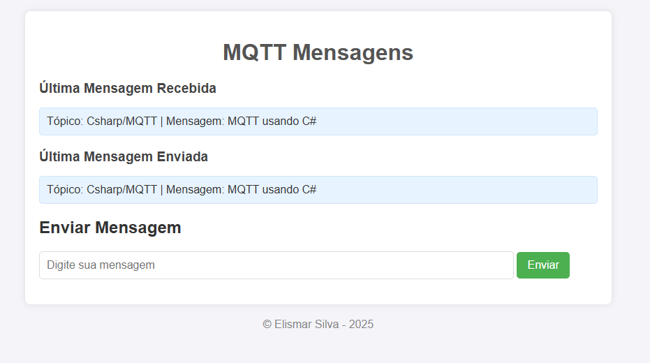

# Página Web para Mensagens MQTT em C#

Uma página web simples desenvolvido em C# que integra o protocolo MQTT para envio e recebimento de mensagens. Este projeto demonstra uma implementação básica de comunicação MQTT usando a biblioteca [MQTTnet](https://github.com/dotnet/MQTTnet) e uma interface web.

## Interface Web


---

## Funcionalidades
- **Comunicação MQTT**: Envie e receba mensagens de um broker MQTT.
- **Interface Web**: Servidor web para exibir e enviar mensagens MQTT.

---

## Requisitos
- .NET 6 ou superior
- Broker MQTT (exemplo: [test.mosquitto.org](https://test.mosquitto.org/))

---

## Começando

### Clonar o Repositório
```bash
git clone https://github.com/ElismarSilva/Web-Panel-for-MQTT-Messages-in-C-.git
cd Web-Panel-for-MQTT-Messages-in-C-
